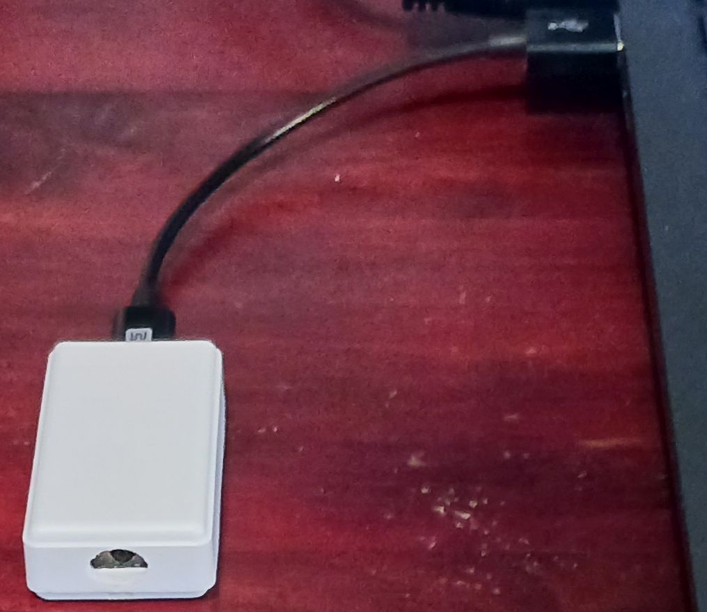
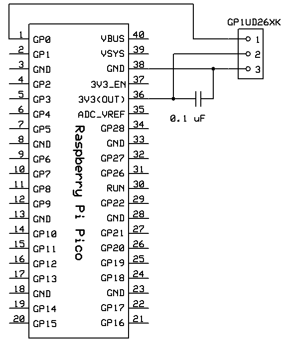

# ir_receiver_keyboard
IR receiver vertual keyboard  

## What is it?
This simple IR receiver made of Raspberry Pi Pico receives IR signal and send the keys to PC as a vertual USB keyboard.
## Schematic
Connect a Raspberry Pi Pico to IR receiver module as follows:  

## How to use
Modify input.c to detect any NEC type IR signal needed. Also modify main.c to decide the keys to be sent.
## USB keyboard code
Following GitHub repository code is used for constructing the vertual USB keyboard:  
[https://github.com/HASOLabo/Pico_USB_Keyboard_Sample](https://github.com/HASOLabo/Pico_USB_Keyboard_Sample)
## License
MIT license